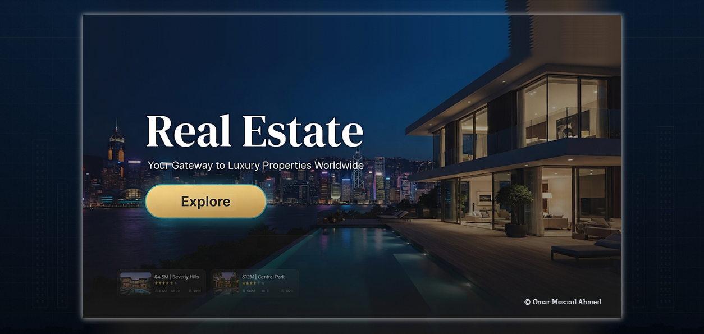
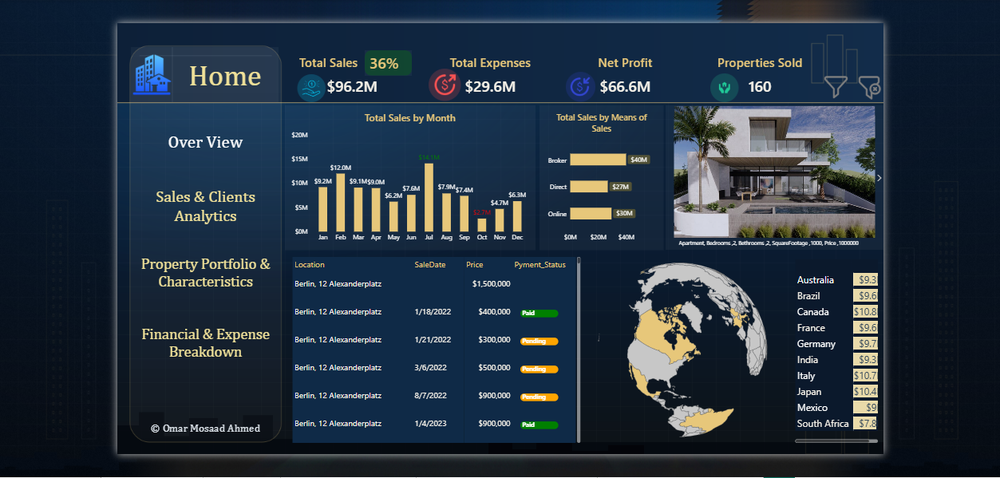
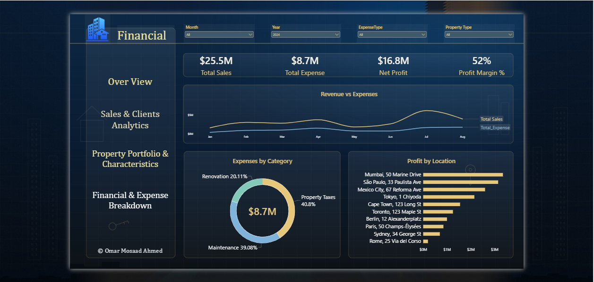
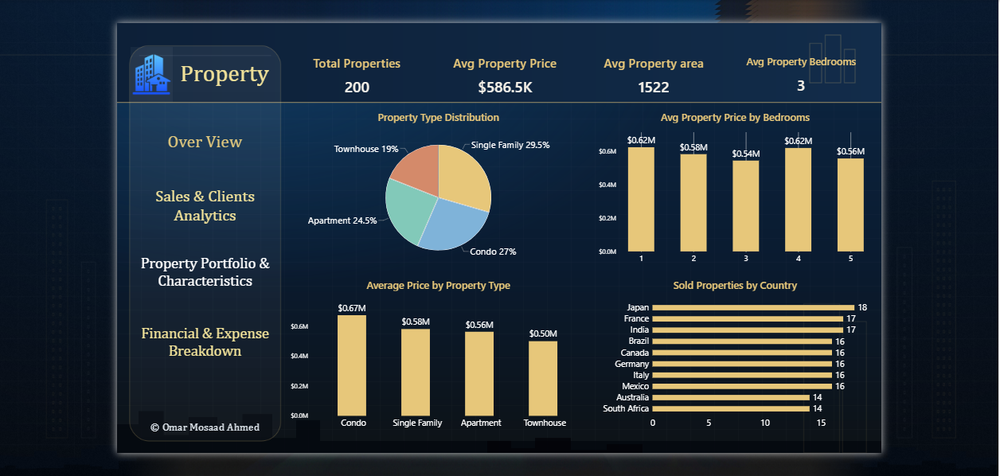
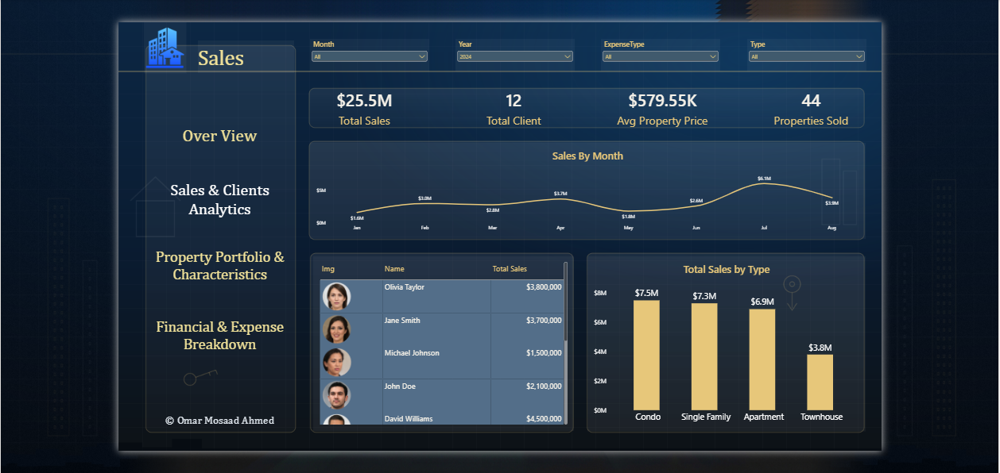

# 🏢 Real Estate Business Intelligence & Analytics Dashboard

لوحة معلومات تفاعلية واحترافية متكاملة لتحليل العقارات والمبيعات والبيانات المالية، تم تصميمها وهندستها باستخدام **Power BI** لتقديم رؤى دقيقة تدعم اتخاذ القرار الاستراتيجي في قطاع العقارات الفاخرة عالمياً.

---

## 🌟 نظرة عامة على المشروع (Project Overview)
يوفر هذا المشروع نظام تحليلي متكامل لإدارة وتحليل أداء المحفظة العقارية، وتتبع حركة المبيعات، ورصد المؤشرات المالية، وتقييم أداء وسطاء العقارات والمواقع الجغرافية المختلفة بدقة عالية.

### 🎨 معاينة الواجهة الرئيسية (Cover & Navigation)

  

---

## 📊 صفحات لوحة المعلومات (Dashboard Pages)

تنقسم اللوحة إلى عدة أقسام رئيسية تفاعلية مصممة بعناية فائقة لتغطية كافة جوانب العمل:

### 1. الصفحة الرئيسية (Home Overview)
تعرض الملخص الشامل للمؤشرات الحيوية (KPIs) مثل إجمالي المبيعات، إجمالي المصروفات، صافي الربح، وعدد العقارات المباعة مع تفاعل جغرافي وزمني.

  

### 2. التحليلات المالية (Financial & Expense Breakdown)
تركز على تفاصيل الإيرادات والمصروفات، تحليل تكاليف الصيانة وتجديد العقارات، وهامش الربح الإجمالي عبر مختلف المواقع.

  

### 3. تحليل العقارات والخصائص (Property Portfolio & Characteristics)
تستعرض توزيع أنواع العقارات (شقق، منازل مستقلة، تاون هاوس)، متوسط الأسعار حسب المساحة وعدد غرف النوم، وأداء المبيعات حسب الدول.

  

### 4. تحليل المبيعات والعملاء (Sales & Clients Analytics)
تتتبع أداء وسطاء المبيعات والموظفين الأبرز، وحجم المبيعات الشهري، ومتوسط أسعار العقارات المباعة لكل عميل.

  

---

## 🛠️ الأداة والتقنيات المستخدمة (Tools & Technologies)
* **Power BI Desktop:** لتصميم وهندسة اللوحة وبناء النماذج البيانية.
* **DAX (Data Analysis Expressions):** لكتابة المعادلات المخصصة وحساب المؤشرات الحيوية (KPI Measures).
* **Power Query:** لعمليات تنظيف ومعالجة وتشكيل البيانات (Data Transformation).
* **UI/UX Design:** تصميم واجهات احترافية بـ طابع بصري داكن (Dark Theme) مخصص للشركات العقارية الكبرى.

---

## 🚀 كيفية تشغيل المشروع (Getting Started)
1. قم بتحميل وتثبيت **Power BI Desktop**.
2. قم بتحميل ملف اللوحة `.pbix` من هذا المستودع.
3. افتح الملف واستمتع باستكشاف التفاعلات والرسوم البيانية!

---

## 👤 إعداد وتطوير (Author)
* **Omar Mosaad Ahmed**
* [GitHub Profile](https://github.com/Omar-Mosaad91)
